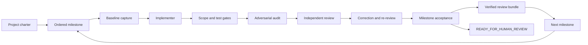
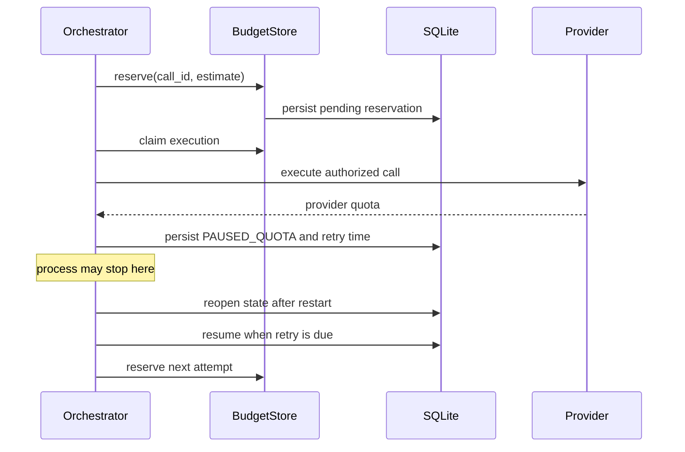
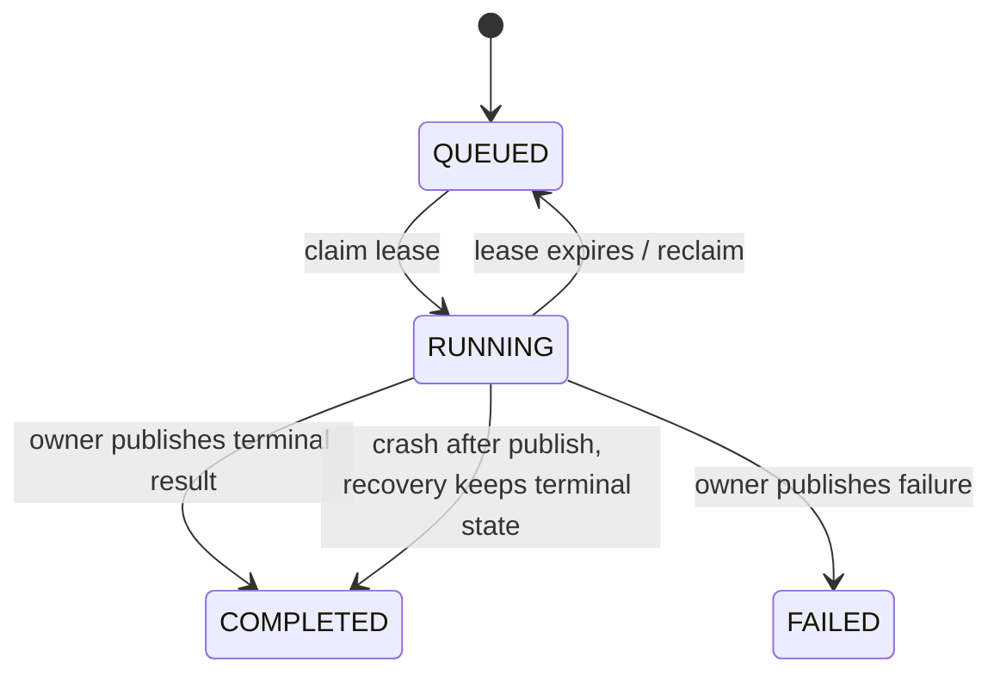

# Dev Autopilot

**A development orchestrator whose review evidence follows the exact code diff.**
Findings carry stable IDs, severity, evidence and a diff hash. A changed diff
invalidates earlier review conclusions. Open P0/P1 findings and any stale finding
block acceptance. Implementation and independent review are separate workflow
roles; local actor labels do not authenticate separate user identities.

SQLite preserves progress across restarts, and a verified review bundle records
what was changed, checked and accepted. This is the core portfolio demonstration:
agent work is accepted against explicit evidence, not just a successful response.

**Development preview: 0.9.1, progressing toward 1.0.0.**
See [execution state](docs/execution-state.json), the [1.0.0 plan](docs/PLAN-1.0.0.md)
and the [capability/evidence matrix](docs/PORTFOLIO-EVIDENCE.md). This is a CLI
preview with no GUI. Linux CI and Docker checks pass. Live provider comparisons,
cost evidence, Colab job recovery and final 1.0.0 acceptance remain pending.

| Evidence | Current scope |
| --- | --- |
| Linux CI | Python 3.11–3.13; 418 tests passed, one opt-in Docker test skipped |
| Docker | Separate live isolation and timeout-cleanup smoke passed |
| Colab | Drive mount, installation and queue startup verified; no job completed |
| Durability soak | About two observed hours so far; eight hours not yet demonstrated |
| Provider quality and cost | Matched live comparisons and measured billing pending |

The [current notebook](notebooks/dev_autopilot_colab_worker.ipynb) pins the
**0.9.1** Drive wheel and verifies SHA-256 before installation. Its Drive build
has its own checksum; use the published release's `SHA256SUMS.txt` for GitHub
downloads. The preview version is a distribution milestone, not a claim that
the [1.0.0 acceptance criteria](docs/PLAN-1.0.0.md) are complete.

Dev Autopilot is a persistent, auditable development orchestrator for scientific
software. It runs bounded implementation, deterministic validation, adversarial
audit, independent review, correction, and evidence packaging while SQLite
preserves every state transition across restarts.

**Version 0.9.1 is a preview release for CLI workflows.** It preserves the
M00-M05 architecture from v0.5.0 while incorporating fixes validated during a
real autonomous TargetIntel-IO milestone:

- automatic built-in Codex, AGY and Claude commands with optional environment overrides;
- structured, repository-bounded read-only AGY auditing;
- automatic recovery from deterministic gate failures through bounded correction;
- continuous retry/resume behavior with short retry intervals for transient agent failures;
- stricter quota-versus-malformed-output classification;
- live verbose project progress reporting;
- stricter changed-file gate handling;
- fixed-size SHA-256 Google Drive appProperties keys for long logical object paths;
- regression coverage for the newly hardened execution paths.
- bounded lexical retrieval over clean Git snapshots with BM25-style ranking,
  filename intent, batch reads, context limits, provenance, and offline reports;
- durable offline soak checks for lease expiry, fencing, terminal publication,
  SQLite reopen, and budget denial;
- read-only health inspection, digest-required container packaging, and a
  deterministic offline demonstration with JSON/HTML evidence.

The autonomous authority boundary still ends before commit, push, pull request,
tag, release publication, or merge. A human approves the final release.

## Operating model



The implementer cannot approve its own work. Review conclusions are attached to
the exact repository diff. Any later change invalidates those conclusions.
Unresolved or invalidated P0/P1 findings prevent milestone acceptance.

### Quota and restart behavior

Calls reserve durable budget before execution. A quota result pauses the run,
and a later process can reopen SQLite and resume when the persisted retry time
is due. The same reservation ID cannot be claimed twice.



The queue uses the same durable pattern for worker leases and fencing:



## What M05 guarantees

- validated YAML/JSON contracts with unknown fields rejected;
- immutable project mission, definition of done, non-goals, autonomy policy, and milestone DAG;
- `ask_questions: false` enforced by schema;
- SQLite state, append-only events, leases, retries, findings, reviews, assumptions, and evidence;
- safe reversible defaults and file-based blockers instead of conversational questions;
- exact Git baseline including tracked and untracked working-tree content;
- strict implementation, audit, and review output validation;
- point IDs such as `M05-SCI-P001` with severity, evidence, resolution, and verifier records;
- fail-closed milestone score and acceptance decision;
- review bundles whose JSON payloads, human HTML report, and folded digest are all verified;
- bounded-memory byte-range split/reassembly with per-part and whole-file SHA-256;
- source identity checks and resume from already verified parts;
- Drive read operations that do not create folders;
- Drive recursive listing, range reads, and resumable media uploads;
- job leases, heartbeats, fencing tokens, monotonic checkpoints, retry limits, and watchdog recovery;
- worker heartbeats during staging, execution, checkpointing, and output upload;
- safe local paths, environment allowlists, process timeouts, and resource preflight;
- attempt-specific output namespaces so stale workers cannot overwrite current results;
- cooperative resume through `DEV_AUTOPILOT_CHECKPOINT_FILE`,
  `DEV_AUTOPILOT_PROGRESS_FILE`, and `DEV_AUTOPILOT_RESUME_SEQUENCE`;
- deterministic offline tests with fake agents and a simulated Drive API.

## Installation

```bash
python -m pip install -e '.[dev]'
```

For Google Drive and Colab workers:

```bash
python -m pip install -e '.[dev,drive]'
```

Python 3.11 or newer is required.

For the 0.9.1 preview, install a wheel from the [GitHub Releases](https://github.com/rsolerortuno/dev-autopilot/releases) page after
checking its SHA-256, or install from source for development:

```bash
python -m pip install ./dev_autopilot-0.9.1-py3-none-any.whl
python -m pip install -e '.[dev]'
```

The supported process environments are Linux and WSL2 with Python 3.11, 3.12,
or 3.13. The project remains CLI-only; no graphical interface is included.

## Continuous no-questions project

Create a charter:

```bash
dev-autopilot project init project.yaml --repository /path/to/worktree
dev-autopilot project plan project.yaml
```

Run it with deterministic fake agents first:

```bash
dev-autopilot --db .dev-autopilot/state.sqlite3 \
  project start project.yaml --fake --json
```

Resume or inspect the persistent project:

```bash
dev-autopilot --db .dev-autopilot/state.sqlite3 \
  project resume PROJECT_RUN_ID --fake --json

dev-autopilot --db .dev-autopilot/state.sqlite3 \
  project status PROJECT_RUN_ID --json
```

A project reaching an unsafe or unresolved condition is marked `BLOCKED` and
writes `ACTION_REQUIRED.md` plus a machine-readable blocker. It does not ask a
chat question. When the persisted resume condition is satisfied, `project
resume` continues from the existing run.

See `examples/m05.project.yaml` and `docs/architecture.md`.

## Single milestone workflow

```bash
dev-autopilot init job.yaml --repository /path/to/isolated-worktree
dev-autopilot doctor --job job.yaml

dev-autopilot --db .dev-autopilot/state.sqlite3 \
  start job.yaml --fake --json
```

A successful final phase performs the acceptance calculation, writes the review
bundle, verifies its complete integrity, and only then reaches
`READY_FOR_HUMAN_REVIEW`.

Real agents use file-based JSON communication:

- `DEV_AUTOPILOT_CONTEXT_FILE` contains bounded task and review context;
- `DEV_AUTOPILOT_OUTPUT_FILE` is where the process writes its strict JSON result;
- `DEV_AUTOPILOT_REPOSITORY` identifies the isolated worktree.

Real execution requires explicit `gates.allow_network: true` and configured argv
arrays for the implementer and reviewers.

## Point-by-point findings and review bundles

A finding contains a stable ID, exact diff hash, severity, category, evidence,
required resolution, status, and independent verification. Findings from a
superseded diff are invalidated and block acceptance until a new review resolves
them against the final diff.

A completed milestone produces:

```text
review-bundle/
├── project.yaml
├── baseline.json
├── final.patch
├── milestones.json
├── findings.json
├── tests.json
├── scientific_gates.json
├── artifacts.json
├── provenance.json
└── report.html
```

Verify every declared payload, reject undeclared files/directories/symlinks,
and validate the HTML report and folded bundle digest:

```bash
dev-autopilot bundle verify /path/to/review-bundle
```

These checksums provide tamper evidence and corruption detection, not origin
authentication. A party able to rewrite the entire unsigned bundle can recompute
the digests; use a trusted distribution channel or an external signature when
authenticity is required.

## Large files without storing them on the laptop

### Split a local file into a local store

```bash
dev-autopilot drive split ./large.h5ad projects/demo/input \
  --store .dev-autopilot/store \
  --profile colab_processing
```

### Split an object already stored in Drive

This range-streams the source object into verified parts without first saving the
complete source on the laptop:

```bash
dev-autopilot drive split-key datasets/large.h5ad datasets/large.parts \
  --drive-folder DRIVE_ROOT_FOLDER_ID \
  --profile colab_processing
```

### Verify or reconstruct

```bash
dev-autopilot drive verify datasets/large.parts \
  --drive-folder DRIVE_ROOT_FOLDER_ID

dev-autopilot drive reassemble datasets/large.parts /content/large.h5ad \
  --drive-folder DRIVE_ROOT_FOLDER_ID
```

Profiles:

- `chatgpt_upload`: 95 MB parts;
- `unstable_network`: 256 MiB parts;
- `colab_processing`: 1 GiB parts.

The implemented strategy is exact byte-range splitting. Format-aware Parquet,
Zarr, H5AD, FASTQ, BAM, or VCF partitioning is intentionally not claimed in M05;
unsupported strategies fail rather than silently producing misleading shards.

## Colab worker

Use `notebooks/dev_autopilot_colab_worker.ipynb`. The notebook:

1. mounts and authenticates Drive;
2. installs an exact `dev-autopilot-0.6.0` wheel from Drive rather than GitHub `main`;
3. detects CPU, high-RAM, GPU, or TPU capability;
4. registers an expiring worker marker;
5. polls the matching queue;
6. claims a job with a fencing token;
7. stages or reassembles inputs;
8. maintains heartbeat and periodic checkpoints;
9. uploads outputs into an attempt-specific namespace;
10. publishes completion only while it still owns the lease.

Submit and inspect a job:

```bash
dev-autopilot colab submit examples/m05.worker-job.json \
  --drive-folder DRIVE_ROOT_FOLDER_ID

dev-autopilot colab status --job-id J-M05-DEMO \
  --drive-folder DRIVE_ROOT_FOLDER_ID
```

Run one or more jobs from any authenticated worker environment:

```bash
dev-autopilot colab register-worker high_ram worker-a \
  --drive-folder DRIVE_ROOT_FOLDER_ID

dev-autopilot colab run high_ram worker-a \
  --drive-folder DRIVE_ROOT_FOLDER_ID \
  --workdir /content/dev-autopilot-work \
  --max-jobs 5
```

Run queue recovery independently:

```bash
dev-autopilot colab watchdog --drive-folder DRIVE_ROOT_FOLDER_ID
```

### Cooperative application checkpoints

The worker can preserve generic process-level state, but it cannot infer how an
arbitrary scientific program should resume an epoch, shard, or matrix block. The
entrypoint should cooperate:

```python
from dev_autopilot.worker.checkpoint import (
    load_resume_checkpoint,
    resume_sequence,
    save_progress,
)

previous = load_resume_checkpoint()
start_shard = int(previous.get("shard", -1)) + 1

for shard in range(start_shard, total_shards):
    process(shard)
    save_progress({"shard": shard})
```

After a Colab interruption, the replacement worker receives the last durable
checkpoint and restarts the same entrypoint with `DEV_AUTOPILOT_RESUME_SEQUENCE`
set appropriately.

## Security boundaries

- Work in an isolated Git worktree.
- Source data should be read-only.
- Do not put API keys, OAuth sessions, SSH keys, browser cookies, or real `.env`
  files in Drive.
- Worker subprocesses receive only the minimal environment plus the explicit
  `env_allowlist`.
- Git metadata writes are rejected when `allow_git_writes` is false.
- Shell test execution requires explicit `allow_shell: true`.
- The local subprocess runtime is not a complete OS sandbox. Docker/Podman
  isolation remains a later deployment milestone.
- Human commit, push, release, and merge authority remains mandatory.

See `SECURITY.md` and `docs/threat-model.md`.

## Validation

The repository-owned path is:

```bash
pytest --cov=dev_autopilot --cov-report=term --cov-fail-under=80 -q
ruff check .
ruff format --check .
mypy
python -m build --no-isolation
git diff --check
```

CI covers Python 3.11, 3.12, and 3.13, installs the Drive extra, validates all
JSON schemas and the Colab notebook, performs a fresh-wheel smoke test, runs a
dependency audit, and provides a separate CodeQL workflow.

The current checkpoint records 418 passing tests and 1 skipped test. Docker
checks are a separate gate and must be approved before a release candidate;
they are not folded into the offline test count. See `VALIDATION.md` for the
exact evidence included with the checkpoint.

## Current limitations

- A managed Colab runtime must still be opened and authenticated by the user.
- Live Google API behavior, account quotas, and actual GPU availability cannot be
  proven by the offline suite; the Drive contract is tested through a simulated
  API and the notebook is structurally validated.
- Drive is used as a durable object store and coordination layer, not as a
  strongly transactional database. A live-lease check prevents duplicate starts
  from eventually consistent queue listings, while fencing tokens and idempotent
  output namespaces protect publication. Duplicate computation can still occur
  during a severe network partition in which a worker cannot observe the lease.
- Only exact byte-range splitting is implemented in M05.
- The local agent runtime remains unsandboxed unless the opt-in Docker adapter is
  configured. Docker isolation requires a Linux host, an installed image pinned
  by digest, and a live smoke test; this repository does not claim that runtime
  enforcement from its offline tests.

These limitations are explicit so a review bundle never claims a stronger
operational guarantee than the evidence supports.
- The offline soak checkpoint records approximately two observed hours so far,
  not a completed eight-hour run or Colab job.
- Provider benchmark comparisons and budget-backed cost evidence are pending.
- No 1.0.0 release or quality claim is made by this 0.9.1 preview; a live
  provider benchmark still requires a planned dataset, budget, and analysis.
